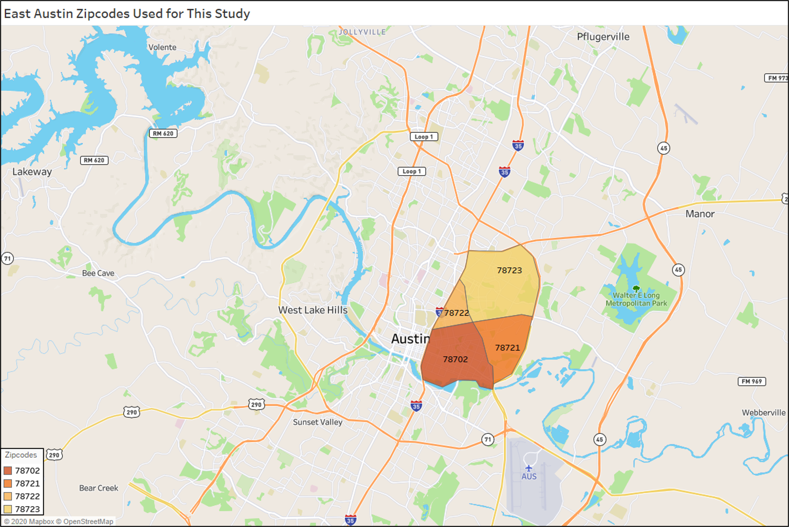
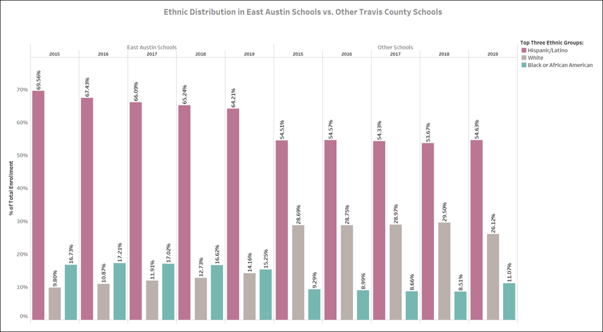
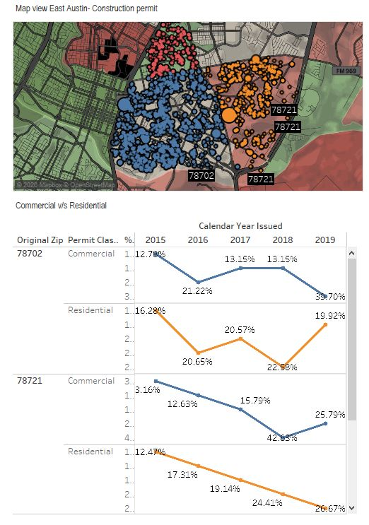

# Gentrification in East Austin from 2015-2019

## Hypothesis: 
Poverty will be more concentrated in East Austin in 2015 as compared to the rest of the city, and as time goes on, the poverty level in East Austin will decrease as gentrification pushes people out of Austin altogether. 
      

      
### Questions:
1. How have income and house values changed over time in both Austin as a whole and in East Austin? 
2. Is there more Section 8 housing (government assisted housing) in East Austin compared to the city as a whole, and is the number of units increasing in East Austin? 
3. What does the school data – ethnicity/race, STAAR scores, enrollment, free and reduced lunch - say about poverty in East Austin?
4. What permits are issued by the city and what do they indicate about poverty in East Austin?
      

### Definition of East Austin:
Zip Codes: 78721, 78702, 78722, 78723  

      

#### Income and House Values
Insert link to Tyler's Tableau  
Add any notes from Tyler
      

#### Section 8 Housing
https://public.tableau.com/profile/jessica.bates#!/vizhome/Section8AustinHousingAnalysisv5/Analysis  
Add any notes from Jessica
      

#### School data: Ethnicity and Academic Performance (STAAR)
Insert link to Amy's Tableau  

##### Ethnic Distribution: 
The Hispanic/Latino ethnic group, which has traditionally formed the majority in East Austin schools, showed a 5% decline in enrollment in these 5 years. There was an accompanying 5% rise in the White student population. Both trends deviate from other Travis County schools, and indicate a demographic shift in East Austin.

##### Academic Performance: 
White students show significant improvement in academic performance compared to others over these 5 years, indicating a shift in the broader East Austin White population. This could be a possible outcome of kids from higher income households coming into the East Austin schools with access to better support and more resources (assuming some join the public school system).

Although these findings from schools do not demonstrate poverty being pushed to East Austin, they do indicate that certain ethnic groups are getting pushed out of East Austin over time -- thus, partially supporting our hypothesis.
      

#### School Data: Free and Reduced Lunch
Insert link to Alicia's Tableau  
Add any notes from Alicia
      

#### Construction Permits
Insert link to Maria and Priyanka's Tableau  
Add any notes from Maria and Priyanka

      

## Conclusion
It seems like the window for gentrification concentrating poverty to East Austin has already passed, and now we're in the phase of gentrificatin pushing people out of Austin altogether. 
     

      

#### Technologies Used
- Python  
- Pandas  
- Tableau  
- Jupyter Notebook  
      

#### Actions and Tasks
Find and clean the data.  
Explore and visualize the data.  
Determine if the data proves or disproves the hypothesis.  
      

##### Main Data Sources: 
1. Income and house values: https://fred.stlouisfed.org/series/ATNHPIUS12420Q  
2. Section 8 housing: https://data.austintexas.gov/Housing-and-Real-Estate/City-of-Austin-Affordable-Housing-Inventory-AHI-/x5p7-qyuv/data  
3. Schools: https://tea.texas.gov/  
4. City permits: https://data.austintexas.gov/Building-and-Development/Issued-Construction-Permits/3syk-w9eu  

      

#### Limitations of Our Data
1. Free and reduced lunch data was not available for 2015.
2. The school data was structured in terms of school years (August to May), but the other data was structured traditionally (January to December).
3. No relavant data was available for zipcode 78762, a small area embedded within 78702. 

##### Team Members: Maria Alzaga, Amy Banerji, Jessica Bates, Priyanka Garg, Alicia Pelkey, and Tyler Pohl

##### UT Data Analysis & Visualization Bootcamp | October 2020
